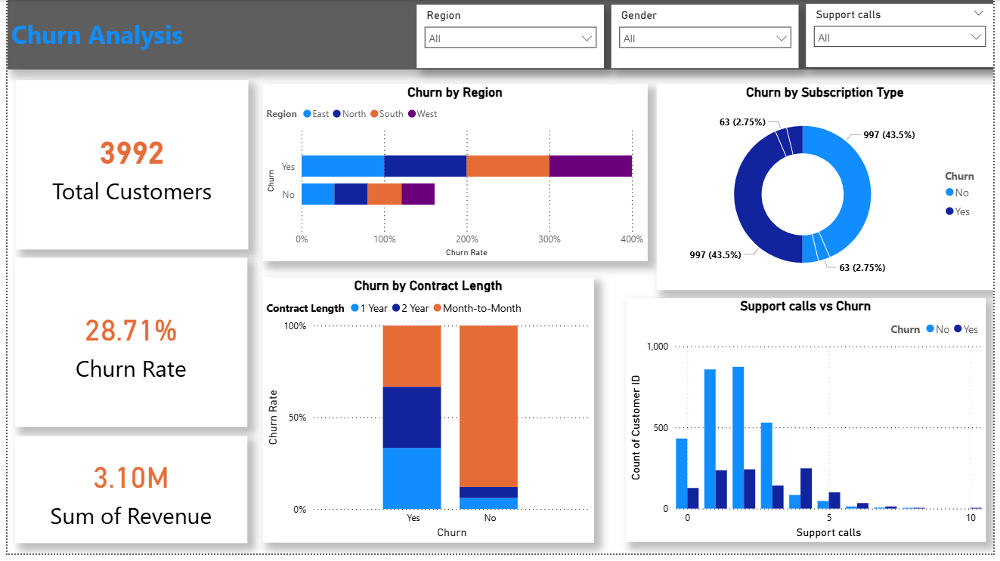

# Customer-Churn-Analysis

Customer churn analysis project using Excel/Power Query/Power BI

---

## 📌 Project Overview
This project analyzes customer churn factors that influence customer retention and churn.
The goal is to help businesses understand why customers leave and improve retention strategies.

---

## 🎯 Objective
- Identify key factors influencing customer churn
- Analyze customer demographics and behavior
- Visualize churn trends
- Provide business recommendations

---

## 🛠 Tools Used
- Microsoft Excel
- Power BI
- Power Query

---

## 📊 Dashboard Features
- Customer churn rate overview
- Churn by contract length
- Monthly charges vs churn
- Tenure distribution
- Interactive filters

---

## 🔍 Key Insights
- Customers with month-to-month contracts have higher churn
- Higher monthly charges increase churn
- Long-term customers have lower churn
- Certain payment methods show higher churn

---

## 💼 Business Recommendations
- Encourage long-term contracts
- Offer loyalty discounts
- Improve service for high-risk customers
- Monitor customers with high monthly charges

---
**Dashboard Preview**

